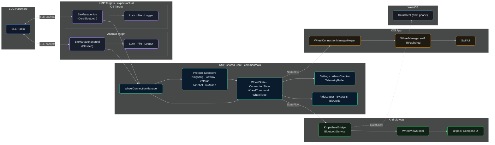

# WheelLog Multiplatform

Open-source companion app for electric unicycles (EUC), built with **Kotlin Multiplatform** to share protocol decoders, settings configuration, and business logic across Android and iOS.

## Supported Wheels

| Manufacturer | Models |
|---|---|
| KingSong | S18, S22, 16X, 18L/XL, and more |
| Gotway / Begode | MCM5, Nikola, Monster, Sherman, etc. |
| Veteran | Sherman, Abrams, Patton |
| InMotion | V5F, V8, V10, V11, V12, V13 |
| InMotion V2 | V14, Challenger |
| Ninebot | Z6/Z10, S2, One C/P/E+, Mini |

## Features

### Real-Time Telemetry
Live dashboard with speed gauge, battery, temperature, voltage, current, power, PWM, and distance tracking.

### Alarm System
Configurable speed, current, temperature, and low-battery alarms with audio beeps, haptic feedback, and optional wheel horn activation. Alarms fire with a 5-second cooldown and work in background mode via local notifications.

### Ride Logging
Record rides to CSV with optional GPS coordinates. Auto-start logging on connect, browse past rides, and share CSV files directly from the app.

### Real-Time Charts
Scrolling 60-second telemetry chart with toggleable series for speed, current, power, and temperature. Built with Swift Charts on iOS.

### Wheel Settings
Per-wheel-type control panels defined once in KMP (`WheelSettingsConfig`) and rendered natively on both platforms. Supports lighting, ride modes, speed limits, alarms, audio, thermal controls, and dangerous actions (calibrate, power off, lock) with confirmation dialogs.

### Auto-Reconnect
Automatic reconnection with exponential backoff (2s to 30s) when connection drops, with cancel UI in the connection banner.

### Background Mode
Maintains BLE connection, alarms, and ride logging when the app is backgrounded. Alarm notifications are delivered as local push notifications.

<!-- Screenshots will go here -->
<!-- |  |  |  | -->
<!-- |---|---|---| -->

## Installation

### Android
Build from source: clone the repo and run `./gradlew :app:assembleDebug`, then install the APK from `app/build/outputs/apk/debug/`.

### iOS
Build from source with Xcode 15+. Open `iosApp/WheelLog.xcodeproj`, select your device/simulator, and build. Requires the KMP framework to be built first (see [Building](#building) below).

## Architecture



### Directory Structure

```
Wheellog.Android/
├── core/                    # Kotlin Multiplatform shared module
│   └── src/
│       ├── commonMain/      # Protocol decoders, wheel state, settings config, connection manager
│       ├── commonTest/      # 580+ unit tests for all shared code
│       ├── androidMain/     # Android BLE implementation
│       └── iosMain/         # iOS CoreBluetooth implementation + Swift bridge helper
├── app/                     # Android app (Jetpack Compose)
├── iosApp/                  # iOS SwiftUI app
│   └── WheelLog/
│       ├── Bridge/          # WheelManager (Swift-to-KMP wrapper)
│       └── Views/           # SwiftUI views
└── wearos/                  # WearOS companion app
```

### Key Principle: Define Once in KMP, Render Natively

Logic that both platforms need lives in `core/src/commonMain/`. Platform UI code (Compose, SwiftUI) reads from shared models and calls shared APIs. Examples:

| Shared in KMP | Android renders with | iOS renders with |
|---|---|---|
| `WheelSettingsConfig` (per-wheel controls) | Compose `WheelSettingsScreen` | SwiftUI `WheelSettingsView` |
| `WheelState` (telemetry data) | Compose `DashboardScreen` | SwiftUI `DashboardView` |
| `DisplayUtils` (formatting) | Both platforms call the same functions | |
| `WheelConnectionManager` (BLE commands) | `WheelViewModel.executeWheelCommand()` | `WheelManager.executeCommand()` |

## Building

### Prerequisites

- Android Studio or IntelliJ with Kotlin Multiplatform plugin
- Xcode 15+ (for iOS)
- JDK 17+

### Commands

```bash
# Run all KMP unit tests
./gradlew :core:testDebugUnitTest

# Compile Android app
./gradlew :app:compileDebugKotlin

# Build Android APK
./gradlew :app:assembleDebug

# Build KMP framework for iOS Simulator
./gradlew :core:linkReleaseFrameworkIosSimulatorArm64

# Build KMP framework for physical iPhone
./gradlew :core:linkReleaseFrameworkIosArm64

# Build iOS app (simulator, from command line)
xcodebuild -project iosApp/WheelLog.xcodeproj -scheme WheelLog \
  -destination 'platform=iOS Simulator,name=iPhone 16 Pro' build
```

### Verification Checklist

Before submitting a PR, run these in order:

```bash
./gradlew :core:testDebugUnitTest                        # 1. All KMP tests pass
./gradlew :app:compileDebugKotlin                        # 2. Android compiles
./gradlew :core:linkReleaseFrameworkIosSimulatorArm64    # 3. iOS framework builds
```

For changes touching iOS Swift code, also run:

```bash
xcodebuild -project iosApp/WheelLog.xcodeproj -scheme WheelLog \
  -destination 'platform=iOS Simulator,name=iPhone 16 Pro' build
```

## Developing Features

### Workflow Overview

Most new features follow this pattern:

1. **Define shared model/logic in KMP** (`core/src/commonMain/`)
2. **Write tests first** (`core/src/commonTest/`)
3. **Run tests to confirm they fail**, then implement, then pass
4. **Build Android UI** (Compose screen + ViewModel wiring + navigation)
5. **Build iOS UI** (SwiftUI view consuming KMP via bridge)
6. **Run the full verification checklist**

### Step-by-Step: Adding a New Shared Feature

#### 1. Create KMP Model

Add your shared types in `core/src/commonMain/kotlin/com/cooper/wheellog/core/`:

```
core/src/commonMain/.../yourpackage/
├── YourModel.kt          # Data classes, enums, sealed classes
└── YourConfig.kt          # Configuration object (if needed)
```

#### 2. Write Tests First

Create a corresponding test file in `core/src/commonTest/`:

```
core/src/commonTest/.../yourpackage/
└── YourModelTest.kt
```

Run with `./gradlew :core:testDebugUnitTest`. Tests should **fail** first (classes don't exist yet), then **pass** after implementation.

#### 3. Wire Up Android

- **ViewModel**: Add a method to `WheelViewModel.kt` that calls into the shared KMP code
- **Screen**: Create a new Composable in `app/src/main/.../compose/screens/`
- **Navigation**: Add a route in `AppNavigation.kt` and hide the bottom bar if it's a detail screen

#### 4. Wire Up iOS

- **Bridge**: If the KMP code needs a Swift-callable wrapper, add it to `WheelConnectionManagerHelper.kt` (iOS-side) and `WheelManager.swift`
- **View**: Create a SwiftUI view in `iosApp/WheelLog/Views/`
- **Xcode**: Add the new `.swift` file to the Xcode project (`WheelLog.xcodeproj`)

### KMP-to-Swift Conventions

When writing KMP code that iOS will consume:

| Kotlin | Swift |
|---|---|
| `object Foo` | `Foo.shared` |
| `enum class Bar { VALUE_A }` | `Bar.valueA` (lowercase) |
| `fun doThing(count: Int)` | `doThing(count: Int32)` (cast with `Int32(value)`) |
| `data class` properties | Direct access (e.g., `state.displayName`) |
| `sealed class` subclasses | `as?` casts (e.g., `control as? ControlSpec.Toggle`) |
| `List<String>` | `[String]` (bridged via NSArray) |
| `companion object` functions | `ClassName.companion.functionName()` |

### Adding Wheel Commands

The `WheelConnectionManager` exposes ~42 suspend commands. To add a new command:

1. Add the command variant to `WheelCommand` sealed class
2. Implement encoding in the relevant decoder's `buildCommand()`
3. Add a suspend method to `WheelConnectionManager`
4. Add a case to `executeCommand()` dispatch (maps `SettingsCommandId` to method)
5. Add iOS bridge wrapper in `WheelConnectionManagerHelper.kt`
6. Add Swift-side method in `WheelManager.swift`

### iOS Testing on Simulator

BLE is not available on iOS Simulator. Use the test mode instead:
1. Run app on simulator
2. Tap "Test KMP Decoder" button
3. Verifies decoder with real Kingsong packets (12% battery, 13 C)

## Android Decoder Mode

The Android app supports three decoder modes under **Settings > Application Settings > Decoder Mode**:

| Mode | Description |
|---|---|
| **Legacy Only** (default) | Original Java/Kotlin decoders |
| **KMP Only** | New cross-platform decoders |
| **Both** | Run both in parallel for comparison |

iOS always uses the KMP decoders.

## Resources

See **[RESOURCES.md](RESOURCES.md)** for a curated collection of EUC protocol documentation, BLE references, open-source hardware projects, VESC resources, and community links. The long-term goal is to move toward open-source EUC hardware and firmware, similar to what VESC did for electric skateboards.

## Contributing

Pull requests are welcome on the `main` branch.

1. Run `./gradlew :core:testDebugUnitTest` before submitting
2. Follow the test-first approach for any new KMP shared code
3. Ensure both Android and iOS compile after your changes
4. Add tests for new behavior - every `commonMain` module should have a corresponding `commonTest` file

## Acknowledgments

Originally based on [WheelLog.Android](https://github.com/Wheellog/Wheellog.Android) by the WheelLog team and [palachzzz fork](https://github.com/palachzzz/WheelLogAndroid).
